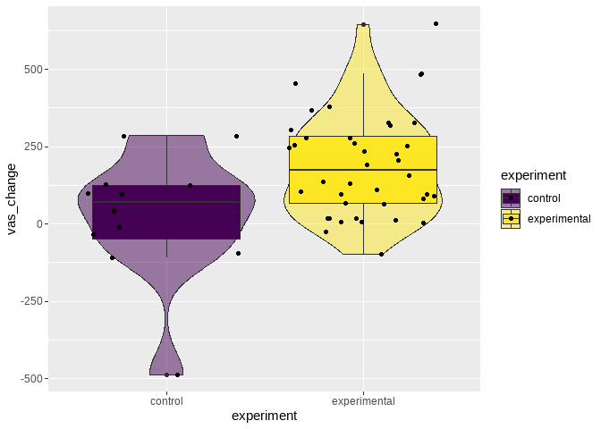
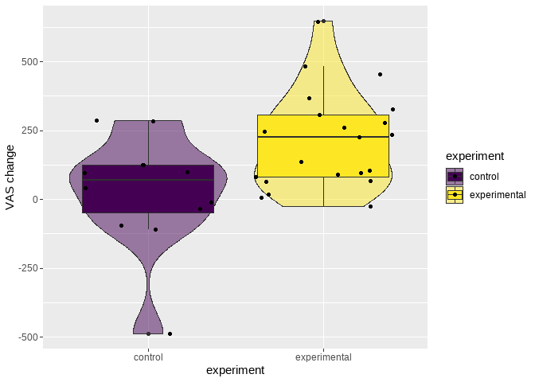
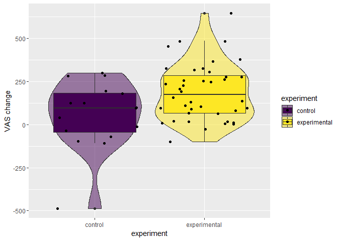
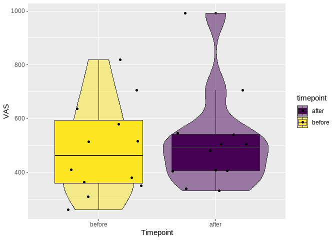
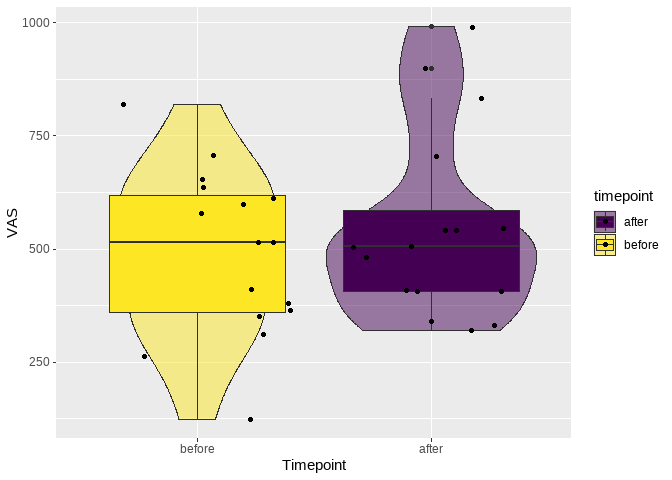

Subjective mental state and Fatigue, an Investigation into possible
paradoxical effects
================

Investigation of the questions as set out in the
[pre-registration](https://osf.io/fybc9).

# VAS difference confirmation

## Self-aware excluded

n = 12.

Phrases leading to exclusion:

- 20007: The participant become more fatigue significantly because of
  their performance expectations
- 20002: I thought the experiment was possibly about the placeblo effect
  and fatigue. I had it in my mind that the experimenter was looking to
  see if me participating in an experiment on neurofeedback
  interventions for fatigue would reduce the levels of fatigue that I
  felt

Are the two experiments different?

<!-- -->

    ## 
    ## Call:
    ## lm(formula = vas_change ~ experiment, data = vas_all_clean_model)
    ## 
    ## Residuals:
    ##     Min      1Q  Median      3Q     Max 
    ## -513.33 -122.55    8.73   98.17  455.80 
    ## 
    ## Coefficients:
    ##             Estimate Std. Error t value Pr(>|t|)   
    ## (Intercept)    26.33      50.49   0.522   0.6043   
    ## experiment    163.87      57.57   2.846   0.0064 **
    ## ---
    ## Signif. codes:  0 '***' 0.001 '**' 0.01 '*' 0.05 '.' 0.1 ' ' 1
    ## 
    ## Residual standard error: 174.9 on 50 degrees of freedom
    ##   (2 observations deleted due to missingness)
    ## Multiple R-squared:  0.1394, Adjusted R-squared:  0.1222 
    ## F-statistic: 8.102 on 1 and 50 DF,  p-value: 0.006398

## Older excluded

Phrases leading to exclusion:

- 20007: The participant become more fatigue significantly because of
  their performance expectations
- 20002: I thought the experiment was possibly about the placeblo effect
  and fatigue. I had it in my mind that the experimenter was looking to
  see if me participating in an experiment on neurofeedback
  interventions for fatigue would reduce the levels of fatigue that I
  felt

Are the two experiments different?

<!-- -->

    ## 
    ## Call:
    ## lm(formula = vas_change ~ experiment, data = vas_all_clean_model)
    ## 
    ## Residuals:
    ##     Min      1Q  Median      3Q     Max 
    ## -513.33 -123.67   15.67   97.67  433.33 
    ## 
    ## Coefficients:
    ##             Estimate Std. Error t value Pr(>|t|)   
    ## (Intercept)    26.33      53.91   0.488  0.62866   
    ## experiment    186.33      67.58   2.757  0.00968 **
    ## ---
    ## Signif. codes:  0 '***' 0.001 '**' 0.01 '*' 0.05 '.' 0.1 ' ' 1
    ## 
    ## Residual standard error: 186.8 on 31 degrees of freedom
    ##   (2 observations deleted due to missingness)
    ## Multiple R-squared:  0.1969, Adjusted R-squared:  0.171 
    ## F-statistic: 7.602 on 1 and 31 DF,  p-value: 0.009683

## All

n = 16.

Are the two experiments different?

<!-- -->

    ## 
    ## Call:
    ## lm(formula = vas_change ~ experiment, data = vas_all_clean_model)
    ## 
    ## Residuals:
    ##    Min     1Q Median     3Q    Max 
    ## -544.5 -123.7    8.8  116.7  455.8 
    ## 
    ## Coefficients:
    ##             Estimate Std. Error t value Pr(>|t|)  
    ## (Intercept)    57.50      43.71   1.316   0.1939  
    ## experiment    132.70      51.72   2.566   0.0131 *
    ## ---
    ## Signif. codes:  0 '***' 0.001 '**' 0.01 '*' 0.05 '.' 0.1 ' ' 1
    ## 
    ## Residual standard error: 174.8 on 54 degrees of freedom
    ##   (2 observations deleted due to missingness)
    ## Multiple R-squared:  0.1087, Adjusted R-squared:  0.09217 
    ## F-statistic: 6.584 on 1 and 54 DF,  p-value: 0.0131

# Control Experiment

## Self-aware excluded

    ## 
    ##  Welch Two Sample t-test
    ## 
    ## data:  vas_test$po_vas and vas_test$pr_vas
    ## t = 0.36444, df = 21.919, p-value = 0.3595
    ## alternative hypothesis: true difference in means is greater than 0
    ## 95 percent confidence interval:
    ##  -97.76232       Inf
    ## sample estimates:
    ## mean of x mean of y 
    ##  513.5833  487.2500

<!-- -->

## All

    ## 
    ##  Welch Two Sample t-test
    ## 
    ## data:  vas_test$po_vas and vas_test$pr_vas
    ## t = 0.83184, df = 29.647, p-value = 0.2061
    ## alternative hypothesis: true difference in means is greater than 0
    ## 95 percent confidence interval:
    ##  -59.86637       Inf
    ## sample estimates:
    ## mean of x mean of y 
    ##   547.125   489.625

<!-- -->

# Personality effects

No relation to conscienciousness.

    ## 
    ## Call:
    ## lm(formula = vas_change ~ CON_full, data = vas_test)
    ## 
    ## Residuals:
    ##     Min      1Q  Median      3Q     Max 
    ## -543.61  -97.65   39.00  138.62  238.07 
    ## 
    ## Coefficients:
    ##             Estimate Std. Error t value Pr(>|t|)
    ## (Intercept)  106.194    348.387   0.305    0.765
    ## CON_full      -1.771     12.532  -0.141    0.890
    ## 
    ## Residual standard error: 204.4 on 14 degrees of freedom
    ## Multiple R-squared:  0.001424,   Adjusted R-squared:  -0.0699 
    ## F-statistic: 0.01996 on 1 and 14 DF,  p-value: 0.8896
